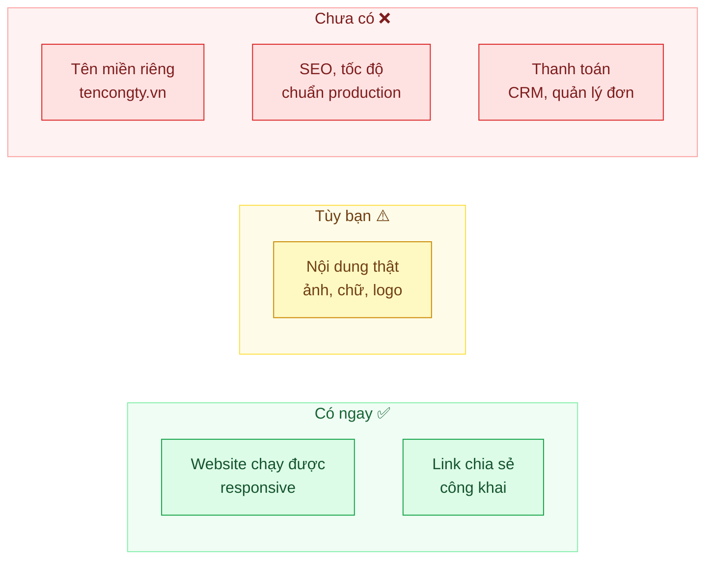

# Quy trình tạo Web AI nhanh với Base44 (trong 1 ngày)

> Phiên bản **rút gọn** của quy trình làm web bằng [Base44](https://app.base44.com/), tập trung vào mục tiêu **ra sản phẩm chạy được trong vòng 1 ngày làm việc**.
> Phù hợp cho landing page giới thiệu, trang bán hàng đơn giản, trang đặt lịch, hoặc bản mẫu cần demo gấp cho khách hàng/sếp xem.
> Dành cho người **không rành kỹ thuật**.

> **Khi nào nên dùng quy trình này?** Khi bạn cần một trang web *đơn giản, chạy được, nhìn ổn* trong thời gian ngắn.
> Nếu dự án phức tạp (nhiều tính năng, tích hợp thanh toán, quản lý đơn hàng...), hãy dùng [quy trình 6 bước đầy đủ](./base44-quy-trinh-lam-web.md).

### Sơ đồ chọn quy trình phù hợp

---

## 1. Tổng quan 4 bước trong 1 ngày

| Bước | Bạn làm gì | Đội dự án làm gì | Thời gian |
|---|---|---|---|
| 1 | Mô tả ý tưởng bằng lời, gửi 2–3 web mẫu tham khảo | Lắng nghe, ghi nhận yêu cầu | ~30 phút |
| 2 | Chờ | Viết prompt, dựng web trên Base44, gửi link xem thử | 2–4 giờ |
| 3 | Xem link, góp ý bằng ngôn ngữ đời thường | Chỉnh sửa theo góp ý (1 vòng) | 1–2 giờ |
| 4 | Duyệt và nhận link chia sẻ | Xuất bản, gửi lại link chính thức | ~30 phút |

### Sơ đồ tổng quan quy trình

```mermaid
flowchart LR
    subgraph S1[Bước 1 — Bạn · 30 phút]
        A1[Mô tả ý tưởng<br/>bằng lời] --> A2[Gửi 2–3 web<br/>tham khảo]
    end

    subgraph S2[Bước 2 — Đội dự án · 2–4 giờ]
        B1[Viết prompt<br/>chi tiết] --> B2[AI dựng web<br/>trên Base44] --> B3[Gửi bạn link<br/>xem thử]
    end

    subgraph S3[Bước 3 — Bạn + Đội dự án · 1–2 giờ]
        C1[Bạn xem &amp;<br/>góp ý] --> C2[Đội dự án<br/>chỉnh sửa] --> C3{Bạn<br/>ưng?}
    end

    subgraph S4[Bước 4 — Đội dự án · 30 phút]
        D1[Xuất bản<br/>lên Base44] --> D2[Gửi link<br/>chính thức]
    end

    A2 ==> B1
    B3 ==> C1
    C3 -->|Chưa| C2
    C3 -->|Ưng rồi| D1
    D2 ==> E([🎉 Xong!<br/>Web chạy được])

    style A1 fill:#dbeafe,stroke:#2563eb,color:#1e3a8a
    style A2 fill:#dbeafe,stroke:#2563eb,color:#1e3a8a
    style B1 fill:#fef3c7,stroke:#d97706,color:#78350f
    style B2 fill:#fef3c7,stroke:#d97706,color:#78350f
    style B3 fill:#fef3c7,stroke:#d97706,color:#78350f
    style C1 fill:#dbeafe,stroke:#2563eb,color:#1e3a8a
    style C2 fill:#fef3c7,stroke:#d97706,color:#78350f
    style C3 fill:#fff4e6,stroke:#ea580c,color:#7c2d12
    style D1 fill:#fef3c7,stroke:#d97706,color:#78350f
    style D2 fill:#fef3c7,stroke:#d97706,color:#78350f
    style E fill:#dcfce7,stroke:#16a34a,stroke-width:3px,color:#14532d
    style S1 fill:#eff6ff,stroke:#93c5fd,color:#1e3a8a
    style S2 fill:#fffbeb,stroke:#fcd34d,color:#78350f
    style S3 fill:#f0f9ff,stroke:#7dd3fc,color:#0c4a6e
    style S4 fill:#fffbeb,stroke:#fcd34d,color:#78350f
```

**Chú thích màu:**
- 🟦 **Xanh dương** = Bạn (khách hàng) thực hiện
- 🟨 **Vàng cam** = Đội dự án thực hiện
- 🟧 **Cam** = Điểm quyết định
- 🟩 **Xanh lá** = Hoàn thành

---

## 2. Bước 1 — Chốt ý tưởng (30 phút)

Bạn không cần viết gì dài dòng. Chỉ cần trả lời **4 câu hỏi** sau (có thể nhắn tin/gọi nói cũng được):

1. **Web này để làm gì?** (giới thiệu công ty, bán sản phẩm, đặt lịch hẹn, landing page cho chiến dịch...)
2. **Ai sẽ là người xem?** (khách hàng cá nhân, doanh nghiệp, học sinh/sinh viên...)
3. **Có những mục nào trên trang?** (ví dụ: Trang chủ, Giới thiệu, Sản phẩm, Liên hệ, Đặt lịch...)
4. **Có mẫu nào bạn thích?** (gửi 2–3 link website tham khảo, nói rõ thích điểm nào: màu sắc, bố cục, phong cách...)

**Mẹo tiết kiệm thời gian:** Chuẩn bị sẵn logo, ảnh sản phẩm, và đoạn giới thiệu ngắn gửi kèm. Nếu chưa có thì dùng tạm placeholder, sau này thay sau.

---

## 3. Bước 2 — Viết prompt & tạo web (2–4 giờ)

Đội dự án sẽ chọn **1 trong 2 công cụ AI** để dựng giao diện:

### Phương án 1 — Base44 (mặc định, cho ra demo nhanh)

- Chuyển câu trả lời của bạn thành một **đoạn mô tả chi tiết** (gọi là *prompt*) để gửi cho AI.
- Đăng nhập [Base44](https://app.base44.com/), nhập prompt.
- AI sẽ tự dựng giao diện và các trang. Đội dự án kiểm tra lại, chỉnh sửa những chỗ rõ ràng sai sót.
- Gửi lại bạn **1 link xem thử** (dạng `*.base44.app`) qua Zalo/email.
- Thường phù hợp khi: cần demo gấp, hoặc khách muốn dùng link Base44 luôn (xem [phương án nâng cao](#7-phương-án-nâng-cao-deepseek--chuyển-sang-wordpress) nếu sau này muốn chuyển sang WordPress).

### Phương án 2 — DeepSeek (cho ra file HTML thuần)

- Đội dự án viết prompt chi tiết cho [DeepSeek](https://chat.deepseek.com/) (hỗ trợ tiếng Việt tốt, có thể kèm ảnh mẫu tham khảo).
- DeepSeek sinh ra **file HTML + CSS thuần** (1 file `index.html` hoặc tách `style.css` riêng).
- Mở thử trên trình duyệt, chỉnh sửa đến khi ưng.
- Thường phù hợp khi: cần file HTML độc lập để **mang đi cài lên WordPress** (có tên miền riêng), hoặc đưa cho dev khác tiếp tục.

Trong thời gian chờ, bạn không cần làm gì — cứ làm việc khác, khi nào có sản phẩm thì mở ra xem.

---

## 4. Bước 3 — Xem, góp ý, sửa nhanh (1–2 giờ)

Mở link trên trình duyệt (Chrome, Safari...) hoặc điện thoại. Xem thoải mái như đang lướt web bình thường.

**Bạn chỉ cần nói cho đội dự án biết 3 thứ:**

1. **Phần nào ưng?** — để giữ nguyên.
2. **Phần nào chưa ưng?** — mô tả bằng lời đời thường, ví dụ:
   - *"Cái nút bấm đặt lịch nhỏ quá, làm to lên"*
   - *"Màu nền nên dùng xanh dương đậm thay vì xám"*
   - *"Thêm một mục 'Câu hỏi thường gặp' ở trang chủ"*
3. **Phần nào thiếu?** — ví dụ: *"Tôi chưa thấy mục Liên hệ"*.

Đội dự án sẽ cập nhật lại trong vòng 1–2 giờ. Vì đây là bản mẫu nhanh, quy trình này chỉ bao gồm **1 vòng góp ý**. Nếu cần chỉnh thêm, xem [quy trình đầy đủ](./base44-quy-trinh-lam-web.md).

---

## 5. Bước 4 — Xuất bản & chia sẻ (30 phút)

Sau khi bạn duyệt, đội dự án sẽ:

- **Xuất bản (publish)** web lên Base44 để có link chính thức, hoạt động 24/7.
- Gửi lại bạn link để dán vào Zalo, email, bio Facebook, hoặc gửi cho bất kỳ ai cần xem.

Link có dạng `ten-ban-chon.base44.app`, ai cũng mở được, không cần đăng nhập.

---

## 6. Bạn sẽ nhận được gì sau 1 ngày?

| Hạng mục | Có / Không | Ghi chú |
|---|---|---|
| 1 website chạy được trên trình duyệt & điện thoại | ✅ Có | Responsive, xem ổn trên mọi thiết bị |
| Link chia sẻ công khai | ✅ Có | Link `*.base44.app`, gửi ai cũng mở được |
| Nội dung thật (ảnh, chữ, logo) | ⚠️ Tùy | Nếu bạn cung cấp đủ ở Bước 1, AI sẽ gắn vào. Nếu không, dùng tạm placeholder để thay sau |
| Tên miền riêng (ví dụ: `tencongty.vn`) | ❌ Không | Tốn thêm thời gian & chi phí mua tên miền, làm ở giai đoạn sau |
| SSL (https), tốc độ tải nhanh, SEO chuẩn | ❌ Không | Làm ở giai đoạn xây dựng bản chính thức |
| Tích hợp thanh toán / quản lý đơn hàng / CRM | ❌ Không | Vượt quá phạm vi "1 ngày", dùng quy trình đầy đủ |

---

## 7. Phương án nâng cao: DeepSeek + chuyển sang WordPress

Ngoài quy trình 4 bước với Base44 ở trên (ra sản phẩm demo trên `*.base44.app`), nếu bạn cần **web chính thức có tên miền riêng, dễ tự chỉnh sửa nội dung sau này**, có thể dùng phương án nâng cao với **DeepSeek** + **WordPress** (kèm ACF). Có 2 cách dùng DeepSeek, tuỳ tình huống:

### Cách A — DeepSeek viết code HTML thuần (rồi chuyển sang WordPress)

Phù hợp khi bạn muốn **file HTML độc lập, không phụ thuộc Base44**, sau đó đội kỹ thuật mang đi cài lên hosting WordPress thật, gắn tên miền riêng, làm SEO chuẩn.

1. Đội dự án viết prompt chi tiết cho [DeepSeek](https://chat.deepseek.com/) (tiếng Việt ok, có thể kèm ảnh mẫu tham khảo).
2. DeepSeek sinh ra **file HTML + CSS thuần** (1 file `index.html` hoặc tách `style.css` riêng).
3. Mở thử trên trình duyệt, chỉnh sửa cho đến khi ưng.
4. Đội kỹ thuật **chuyển file HTML đó thành WordPress page template (PHP)** bằng skill `devvn-html-to-wp-acf`:
   - Tách từng phần nội dung (heading, đoạn văn, ảnh, danh sách...) thành các **trường ACF** (Advanced Custom Fields).
   - Đăng ký field group trong `functions.php` bằng PHP (không cần import JSON).
   - Tạo page template `page-xxx.php` dùng `get_field()` / `have_rows()` để render.
   - Minify CSS inline, strip asset thừa của WP để giữ tốc độ tải nhanh.
5. Khách hàng **tự chỉnh sửa nội dung** trong wp-admin → Pages → sửa trực tiếp vào ACF, không cần đụng code.

### Cách B — DeepSeek hỗ trợ Base44

Phù hợp khi bạn đã dùng Base44 ra demo và cần *nâng cấp thành web chính thức trên WordPress*:

1. Dùng Base44 ra bản demo nhanh (quy trình 4 bước ở trên).
2. Dùng **DeepSeek** để:
   - Viết prompt tốt hơn cho Base44 (nếu muốn sinh thêm section).
   - Sinh code HTML thuần từ bản Base44 (copy giao diện, viết lại bằng HTML/CSS sạch).
   - Sinh snippet PHP/ACF mẫu để đội kỹ thuật tham khảo khi chuyển sang WordPress.
3. Đội kỹ thuật lấy HTML thuần đó, áp skill `devvn-html-to-wp-acf` để chuyển sang WordPress.

### Sơ đồ pipeline: từ giao diện code sang WordPress

```mermaid
flowchart LR
    subgraph Input["Đầu vào"]
        I1["Mô tả yêu cầu<br/>(tiếng Việt)"]
    end

    subgraph Gen["Sinh giao diện"]
        G1["DeepSeek<br/>chat.deepseek.com"]
        G2["Base44<br/>app.base44.com"]
    end

    subgraph HTML["HTML thuần"]
        H1["index.html<br/>+ style.css"]
    end

    subgraph WP["Chuyển sang WordPress<br/>(skill devvn-html-to-wp-acf)"]
        W1["Phân tích cấu trúc<br/>section / field"]
        W2["Đăng ký ACF field<br/>(PHP thuần)"]
        W3["Viết page template<br/>(PHP + get_field)"]
        W4["Minify CSS<br/>+ strip asset"]
    end

    subgraph Out["Sản phẩm cuối"]
        O1["Website WordPress<br/>tên miền riêng"]
        O2["Khách tự sửa nội dung<br/>qua wp-admin + ACF"]
    end

    I1 --> G1
    I1 --> G2
    G1 --> H1
    G2 -.Demo.-> H1
    H1 --> W1 --> W2 --> W3 --> W4 --> O1 --> O2

    style I1 fill:#dbeafe,stroke:#2563eb,color:#1e3a8a
    style G1 fill:#fef3c7,stroke:#d97706,color:#78350f
    style G2 fill:#fef3c7,stroke:#d97706,color:#78350f
    style H1 fill:#e0e7ff,stroke:#4f46e5,color:#312e81
    style W1 fill:#fce7f3,stroke:#db2777,color:#831843
    style W2 fill:#fce7f3,stroke:#db2777,color:#831843
    style W3 fill:#fce7f3,stroke:#db2777,color:#831843
    style W4 fill:#fce7f3,stroke:#db2777,color:#831843
    style O1 fill:#dcfce7,stroke:#16a34a,color:#14532d
    style O2 fill:#dcfce7,stroke:#16a34a,color:#14532d
```

**Chú thích màu:**
- 🟦 **Xanh dương** = Đầu vào
- 🟨 **Vàng cam** = AI sinh giao diện
- 🟪 **Tím** = HTML thuần (output)
- 🟥 **Hồng** = Skill devvn-html-to-wp-acf
- 🟩 **Xanh lá** = WordPress chính thức

### Vì sao cần chuyển qua WordPress (ACF)?

- **Khách tự sửa được**: thay ảnh, đổi chữ, thêm sản phẩm — không cần nhờ dev, không sợ hỏng layout.
- **Tên miền riêng** (vd: `tencongty.vn`), hosting riêng, SEO chuẩn WordPress.
- **Mở rộng dễ**: thêm form liên hệ (CF7, WPForms), thanh toán (WooCommerce), đa ngôn ngữ, blog...
- **Tốc độ tải tốt** nhờ minify CSS + strip asset thừa (theo skill `devvn-html-to-wp-acf`).
- **Bảo trì độc lập**: web có thể sống nhiều năm, đổi người quản trị vẫn vận hành được.

> **Lưu ý:** Bước chuyển HTML → WordPress cần *đội kỹ thuật* thực hiện (không phải AI tự làm xong). DeepSeek có thể sinh code PHP/ACF mẫu để tham khảo, nhưng dev người thật sẽ kiểm tra, fix lỗi, tối ưu trước khi đưa lên production.

---

---

## 8. Checklist chuẩn bị trước khi bắt đầu

Để quy trình trơn tru, bạn cần chuẩn bị sẵn (nếu có):

- ☐ Logo (file PNG/SVG, nền trong suốt càng tốt)
- ☐ 3–5 ảnh sản phẩm/dịch vụ chính
- ☐ Đoạn giới thiệu ngắn về công ty/cá nhân (3–5 dòng)
- ☐ Số điện thoại, email, địa chỉ muốn hiển thị trên web
- ☐ 2–3 link website tham khảo + ghi chú thích điểm nào
- ☐ Tên gợi ý cho link web (ví dụ: `hoatuoi-hanoi.base44.app`)

*Không có cũng không sao — AI sẽ dùng nội dung tạm, bạn thay sau cũng được.*

---

## 9. Câu hỏi thường gặp

**Hỏi: Tôi chưa có logo thì sao?**
Không sao. AI sẽ dùng tên thương hiệu thay thế. Khi nào có logo thật, gửi đội dự án để cập nhật.

**Hỏi: Tôi muốn thay đổi nhiều lần, mỗi lần đều mất 1 ngày à?**
Không. Quy trình 1 ngày này chỉ tính cho **1 vòng đầu tiên**. Sau khi có bản mẫu, những chỉnh sửa nhỏ tiếp theo thường chỉ mất 1–3 giờ.

**Hỏi: Bản web làm trong 1 ngày có dùng được lâu dài không?**
Được, với điều kiện bạn chấp nhận dùng link `*.base44.app` và không cần tên miền riêng, SEO cao, hay tích hợp hệ thống phức tạp. Nếu sau này cần, sẽ nâng cấp lên bản chính thức.

**Hỏi: Tôi muốn tự thao tác trên Base44 có được không?**
Được, nhưng cần học cách viết prompt hiệu quả. Nếu muốn tự làm, đội dự án có thể hướng dẫn thêm (tính phí riêng).

**Hỏi: Chi phí cho quy trình 1 ngày này là bao nhiêu?**
Liên hệ trực tiếp đội dự án để nhận báo giá. Chi phí thường thấp hơn nhiều so với quy trình đầy đủ vì giới hạn phạm vi.

**Hỏi: Nên dùng Base44 hay DeepSeek?**
*Base44* cho ra link demo nhanh, xem được ngay trên trình duyệt, phù hợp khi cần demo gấp.
*DeepSeek* cho ra file HTML thuần, phù hợp khi cần mang đi cài lên WordPress, hosting riêng, tên miền riêng.
Xem chi tiết ở [mục 7 — Phương án nâng cao](#7-phương-án-nâng-cao-deepseek--chuyển-sang-wordpress).

**Hỏi: Tôi có thể dùng cả Base44 lẫn DeepSeek không?**
Được. Thường làm Base44 trước (ra demo nhanh để duyệt ý tưởng), rồi dùng DeepSeek sinh HTML sạch từ bản Base44 để chuyển sang WordPress.

**Hỏi: Chuyển HTML sang WordPress mất bao lâu?**
Tuỳ độ phức tạp của giao diện. Trang đơn giản (1–2 section) thường 1–2 ngày. Landing page nhiều section, repeater nhiều, form phức tạp có thể 3–5 ngày. Đội kỹ thuật sẽ báo cụ thể sau khi nhận HTML.

**Hỏi: Sau khi chuyển sang WordPress, tôi tự sửa nội dung được không?**
Được — đó là lý do chính dùng ACF. Bạn vào `wp-admin → Pages`, mở trang, sửa trực tiếp các trường (tiêu đề, đoạn văn, ảnh, danh sách...). Không cần đụng code.

---

## 10. Tài liệu liên quan

- [Base44 — Quy trình làm web mẫu (6 bước, đầy đủ)](./base44-quy-trinh-lam-web.md): dùng khi dự án phức tạp, cần nhiều vòng góp ý, muốn ra bản chính thức.
- Skill `devvn-html-to-wp-acf`: hướng dẫn chi tiết kỹ thuật chuyển HTML thuần → WordPress page template (PHP) + ACF. Dùng nội bộ đội kỹ thuật.
- [DeepSeek Chat](https://chat.deepseek.com/): công cụ AI sinh code HTML/CSS/JS từ prompt tiếng Việt.
- [Base44](https://app.base44.com/): công cụ AI sinh web app hoàn chỉnh, có link demo công khai.

---

*Tài liệu rút gọn — cập nhật ngày 28/08/2026. Mọi thắc mắc xin liên hệ trực tiếp đội dự án.*
