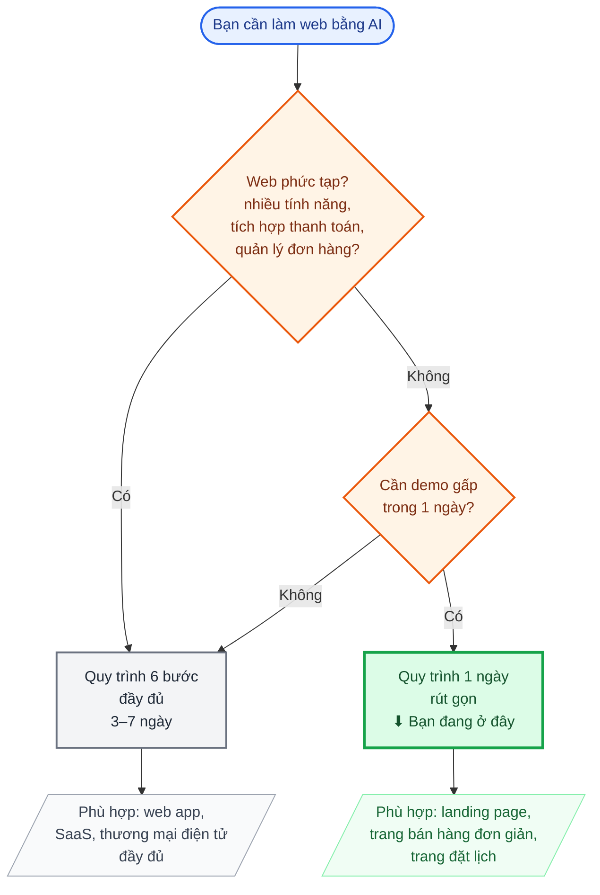
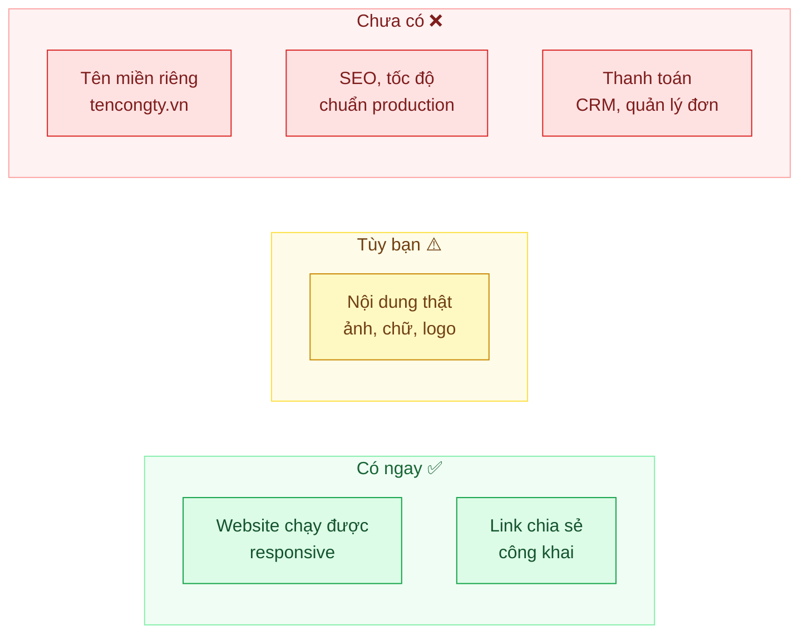

# Quy trình tạo Web AI nhanh với Base44 (trong 1 ngày)

> Phiên bản **rút gọn** của quy trình làm web bằng [Base44](https://app.base44.com/), tập trung vào mục tiêu **ra sản phẩm chạy được trong vòng 1 ngày làm việc**.
> Phù hợp cho landing page giới thiệu, trang bán hàng đơn giản, trang đặt lịch, hoặc bản mẫu cần demo gấp cho khách hàng/sếp xem.
> Dành cho người **không rành kỹ thuật**.

> **Khi nào nên dùng quy trình này?** Khi bạn cần một trang web *đơn giản, chạy được, nhìn ổn* trong thời gian ngắn.
> Nếu dự án phức tạp (nhiều tính năng, tích hợp thanh toán, quản lý đơn hàng...), hãy dùng [quy trình 6 bước đầy đủ](./base44-quy-trinh-lam-web.md).

### Sơ đồ chọn quy trình phù hợp

---

## 1. Tổng quan 4 bước trong 1 ngày

| Bước | Bạn làm gì | Đội dự án làm gì | Thời gian |
|---|---|---|---|
| 1 | Mô tả ý tưởng bằng lời, gửi 2–3 web mẫu tham khảo | Lắng nghe, ghi nhận yêu cầu | ~30 phút |
| 2 | Chờ | Viết prompt, dựng web trên Base44, gửi link xem thử | 2–4 giờ |
| 3 | Xem link, góp ý bằng ngôn ngữ đời thường | Chỉnh sửa theo góp ý (1 vòng) | 1–2 giờ |
| 4 | Duyệt và nhận link chia sẻ | Xuất bản, gửi lại link chính thức | ~30 phút |

### Sơ đồ tổng quan quy trình

**Chú thích màu:**
- 🟦 **Xanh dương** = Bạn (khách hàng) thực hiện
- 🟨 **Vàng cam** = Đội dự án thực hiện
- 🟧 **Cam** = Điểm quyết định
- 🟩 **Xanh lá** = Hoàn thành

---

## 2. Bước 1 — Chốt ý tưởng (30 phút)

Bạn không cần viết gì dài dòng. Chỉ cần trả lời **4 câu hỏi** sau (có thể nhắn tin/gọi nói cũng được):

1. **Web này để làm gì?** (giới thiệu công ty, bán sản phẩm, đặt lịch hẹn, landing page cho chiến dịch...)
2. **Ai sẽ là người xem?** (khách hàng cá nhân, doanh nghiệp, học sinh/sinh viên...)
3. **Có những mục nào trên trang?** (ví dụ: Trang chủ, Giới thiệu, Sản phẩm, Liên hệ, Đặt lịch...)
4. **Có mẫu nào bạn thích?** (gửi 2–3 link website tham khảo, nói rõ thích điểm nào: màu sắc, bố cục, phong cách...)

**Mẹo tiết kiệm thời gian:** Chuẩn bị sẵn logo, ảnh sản phẩm, và đoạn giới thiệu ngắn gửi kèm. Nếu chưa có thì dùng tạm placeholder, sau này thay sau.

---

## 3. Bước 2 — Viết prompt & tạo web (2–4 giờ)

Đội dự án sẽ:

- Chuyển câu trả lời của bạn thành một **đoạn mô tả chi tiết** (gọi là *prompt*) để gửi cho AI.
- Đăng nhập [Base44](https://app.base44.com/), nhập prompt.
- AI sẽ tự dựng giao diện và các trang. Đội dự án kiểm tra lại, chỉnh sửa những chỗ rõ ràng sai sót.
- Gửi lại bạn **1 link xem thử** (dạng `*.base44.app`) qua Zalo/email.

Trong thời gian chờ, bạn không cần làm gì — cứ làm việc khác, khi nào có link thì mở ra xem.

---

## 4. Bước 3 — Xem, góp ý, sửa nhanh (1–2 giờ)

Mở link trên trình duyệt (Chrome, Safari...) hoặc điện thoại. Xem thoải mái như đang lướt web bình thường.

**Bạn chỉ cần nói cho đội dự án biết 3 thứ:**

1. **Phần nào ưng?** — để giữ nguyên.
2. **Phần nào chưa ưng?** — mô tả bằng lời đời thường, ví dụ:
   - *"Cái nút bấm đặt lịch nhỏ quá, làm to lên"*
   - *"Màu nền nên dùng xanh dương đậm thay vì xám"*
   - *"Thêm một mục 'Câu hỏi thường gặp' ở trang chủ"*
3. **Phần nào thiếu?** — ví dụ: *"Tôi chưa thấy mục Liên hệ"*.

Đội dự án sẽ cập nhật lại trong vòng 1–2 giờ. Vì đây là bản mẫu nhanh, quy trình này chỉ bao gồm **1 vòng góp ý**. Nếu cần chỉnh thêm, xem [quy trình đầy đủ](./base44-quy-trinh-lam-web.md).

---

## 5. Bước 4 — Xuất bản & chia sẻ (30 phút)

Sau khi bạn duyệt, đội dự án sẽ:

- **Xuất bản (publish)** web lên Base44 để có link chính thức, hoạt động 24/7.
- Gửi lại bạn link để dán vào Zalo, email, bio Facebook, hoặc gửi cho bất kỳ ai cần xem.

Link có dạng `ten-ban-chon.base44.app`, ai cũng mở được, không cần đăng nhập.

---

## 6. Bạn sẽ nhận được gì sau 1 ngày?

| Hạng mục | Có / Không | Ghi chú |
|---|---|---|
| 1 website chạy được trên trình duyệt & điện thoại | ✅ Có | Responsive, xem ổn trên mọi thiết bị |
| Link chia sẻ công khai | ✅ Có | Link `*.base44.app`, gửi ai cũng mở được |
| Nội dung thật (ảnh, chữ, logo) | ⚠️ Tùy | Nếu bạn cung cấp đủ ở Bước 1, AI sẽ gắn vào. Nếu không, dùng tạm placeholder để thay sau |
| Tên miền riêng (ví dụ: `tencongty.vn`) | ❌ Không | Tốn thêm thời gian & chi phí mua tên miền, làm ở giai đoạn sau |
| SSL (https), tốc độ tải nhanh, SEO chuẩn | ❌ Không | Làm ở giai đoạn xây dựng bản chính thức |
| Tích hợp thanh toán / quản lý đơn hàng / CRM | ❌ Không | Vượt quá phạm vi "1 ngày", dùng quy trình đầy đủ |

---

## 7. Checklist chuẩn bị trước khi bắt đầu

Để quy trình trơn tru, bạn cần chuẩn bị sẵn (nếu có):

- ☐ Logo (file PNG/SVG, nền trong suốt càng tốt)
- ☐ 3–5 ảnh sản phẩm/dịch vụ chính
- ☐ Đoạn giới thiệu ngắn về công ty/cá nhân (3–5 dòng)
- ☐ Số điện thoại, email, địa chỉ muốn hiển thị trên web
- ☐ 2–3 link website tham khảo + ghi chú thích điểm nào
- ☐ Tên gợi ý cho link web (ví dụ: `hoatuoi-hanoi.base44.app`)

*Không có cũng không sao — AI sẽ dùng nội dung tạm, bạn thay sau cũng được.*

---

## 8. Câu hỏi thường gặp

**Hỏi: Tôi chưa có logo thì sao?**
Không sao. AI sẽ dùng tên thương hiệu thay thế. Khi nào có logo thật, gửi đội dự án để cập nhật.

**Hỏi: Tôi muốn thay đổi nhiều lần, mỗi lần đều mất 1 ngày à?**
Không. Quy trình 1 ngày này chỉ tính cho **1 vòng đầu tiên**. Sau khi có bản mẫu, những chỉnh sửa nhỏ tiếp theo thường chỉ mất 1–3 giờ.

**Hỏi: Bản web làm trong 1 ngày có dùng được lâu dài không?**
Được, với điều kiện bạn chấp nhận dùng link `*.base44.app` và không cần tên miền riêng, SEO cao, hay tích hợp hệ thống phức tạp. Nếu sau này cần, sẽ nâng cấp lên bản chính thức.

**Hỏi: Tôi muốn tự thao tác trên Base44 có được không?**
Được, nhưng cần học cách viết prompt hiệu quả. Nếu muốn tự làm, đội dự án có thể hướng dẫn thêm (tính phí riêng).

**Hỏi: Chi phí cho quy trình 1 ngày này là bao nhiêu?**
Liên hệ trực tiếp đội dự án để nhận báo giá. Chi phí thường thấp hơn nhiều so với quy trình đầy đủ vì giới hạn phạm vi.

---

## 9. Tài liệu liên quan

- [Base44 — Quy trình làm web mẫu (6 bước, đầy đủ)](./base44-quy-trinh-lam-web.md): dùng khi dự án phức tạp, cần nhiều vòng góp ý, muốn ra bản chính thức.

---

*Tài liệu rút gọn — cập nhật ngày 28/08/2026. Mọi thắc mắc xin liên hệ trực tiếp đội dự án.*
