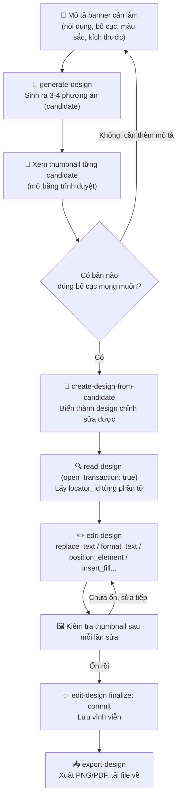

# Dùng Canva MCP trong Claude Code để thiết kế banner bằng AI

> **Mục đích:** Dùng connector **Canva MCP** ngay trong Claude Code để tạo, chỉnh sửa và xuất banner quảng cáo (Facebook Ads, Instagram, poster...) bằng AI — từ mô tả bằng lời tới file ảnh hoàn chỉnh, không cần mở app Canva thủ công.

---

## 1. Tổng quan

| Thành phần | Vai trò |
|---|---|
| **Canva MCP** | Connector kết nối Claude Code với tài khoản Canva của bạn |
| `generate-design` | Sinh nhiều phương án thiết kế từ một đoạn mô tả (prompt) |
| `create-design-from-candidate` | Biến 1 phương án AI sinh ra thành design **chỉnh sửa được** |
| `read-design` / `edit-design` | Đọc cấu trúc design (text, ảnh, vị trí...) và sửa từng phần tử |
| `create-design-from-brand-template` | Tạo design từ một **template có sẵn** trên Canva (kể cả link công khai) |
| `upload-asset-from-url` | Tải ảnh (vd: logo) từ một URL công khai vào thư viện Canva |
| `export-design` | Xuất design ra file (PNG, PDF, JPG...) để tải về máy |

Toàn bộ thao tác đều qua chat — Claude Code gọi các tool này thay bạn, bạn chỉ cần mô tả yêu cầu và duyệt kết quả.

---

## 2. Quy trình tạo banner mới bằng AI

### 2.1 Sơ đồ luồng hoạt động



### 2.2 Bước 1 — Mô tả banner thật chi tiết

Prompt cho `generate-design` càng chi tiết, kết quả càng sát yêu cầu. Nên mô tả rõ:

- **Bố cục**: chia layout thế nào (trái/phải, trên/dưới), phần nào là điểm nhấn lớn nhất
- **Nội dung chữ**: tiêu đề, slogan, danh sách lợi ích, nút CTA, thông tin liên hệ — viết rõ **nguyên văn** câu chữ muốn có
- **Màu sắc**: mã màu chủ đạo (hex), màu phối, có gradient hay không
- **Phong cách**: hiện đại/cổ điển, sang trọng/trẻ trung, tránh phong cách gì
- **`design_type`**: chọn loại gần với kích thước cần (vd `instagram_post` ra đúng 1080×1350px tỷ lệ 4:5, `facebook_cover` ra banner ngang...)

> 💡 **Kinh nghiệm:** mô tả tiếng Việt có dấu đầy đủ trong prompt để AI ưu tiên sinh chữ tiếng Việt đúng. Vẫn nên **kiểm tra lại chính tả** ở bước sau vì thỉnh thoảng AI viết sai dấu hoặc dịch lẫn sang tiếng Anh.

### 2.3 Bước 2 — Duyệt các candidate trước khi chọn

`generate-design` luôn trả về **nhiều phương án** (thường 4). Mỗi phương án chỉ là ảnh xem trước (thumbnail), **chưa** phải design thật. Nên mở từng thumbnail bằng trình duyệt để so sánh, vì:

- Các bản có thể rất khác nhau về bố cục dù cùng 1 prompt
- Có bản bị lỗi chữ tiếng Việt (sai dấu, vỡ font)
- Có bản thiếu nội dung hoặc bố cục không đúng ý

Chỉ sau khi chọn được bản ưng ý nhất mới gọi `create-design-from-candidate` để biến nó thành design thật (có `design_id`) — từ lúc này mới sửa được.

### 2.4 Bước 3 — Sửa nội dung bằng `edit-design`

Quy trình sửa một trang design:

1. `read-design` với `open_transaction: true` → nhận về `transaction_id` và toàn bộ cấu trúc trang (mỗi phần tử có 1 `locator_id` riêng)
2. Gọi `edit-design` với danh sách `operations`, ví dụ:
   - `replace_text` — đổi nội dung chữ
   - `format_text` — đổi cỡ chữ, đậm/nhạt, màu, căn lề...
   - `position_element` / `resize_element` — di chuyển, đổi kích thước
   - `insert_fill` — chèn ảnh mới (vd logo) vào một vị trí
   - `delete_element` — xoá phần tử (vd chữ placeholder "your logo")
3. Sau **mỗi lần sửa**, tool trả về thumbnail mới — luôn xem lại thumbnail để phát hiện lỗi (chữ tràn khung, xuống dòng sai chỗ, chồng chữ...) trước khi sửa tiếp
4. Khi đã ưng ý, gọi lại `edit-design` với `finalize: "commit"` (không kèm `operations`) để **lưu vĩnh viễn** — bước này không thể hoàn tác

> ⚠️ **Lỗi hay gặp:** hộp chữ có độ rộng cố định — nếu thay bằng câu dài hơn, chữ sẽ tự xuống dòng và làm lệch với icon/bullet đi kèm. Nên rút ngắn câu hoặc tăng `width` của hộp chữ, rồi kiểm tra lại thumbnail.

### 2.5 Bước 4 — Xuất file

```
export-design(design_id, format: { type: "png", export_quality: "pro" })
```

Trả về link tải tạm thời → tải file này về máy (vd bằng `curl`) rồi gửi cho người dùng.

---

## 3. Dùng template có sẵn trên Canva + chèn logo riêng

Khi đã có sẵn 1 template ưng ý (tự chọn trên canva.com, hoặc người dùng gửi link), quy trình gọn hơn nhiều vì không cần AI sinh từ đầu:

### 3.1 Mở template thành design chỉnh sửa được

```
create-design-from-brand-template(brand_template_id: "EAxxxxxxxxx")
```

`brand_template_id` là đoạn ID trong link Canva, ví dụ link
`https://www.canva.com/templates/EAHE2xPawrU/` → ID là `EAHE2xPawrU`.

> Lưu ý: trang tìm kiếm template (`canva.com/s/templates?query=...`) yêu cầu đăng nhập nên Claude Code **không tự duyệt được** danh sách kết quả. Cách nhanh nhất: người dùng tự chọn 1 mẫu ưng ý trên trình duyệt của họ rồi gửi link cho Claude Code mở đúng mẫu đó.

### 3.2 Chèn logo/ảnh riêng vào template

Muốn chèn ảnh từ máy (vd logo công ty), Canva chỉ nhận **URL công khai** — không có đường nào để tải thẳng file local. Quy trình:

1. **Xin phép người dùng rõ ràng** trước khi đưa file riêng tư của họ lên mạng, dù chỉ tạm thời
2. Tải file lên một host tạm (vd `tmpfiles.org`, có đặt thời gian hết hạn) → lấy URL tải trực tiếp (chú ý: một số host trả về trang xem trước dạng HTML thay vì file gốc — cần lấy đúng link `raw`/`dl`)
3. `upload-asset-from-url(url, name)` → Canva tải ảnh về thư viện, trả về `asset_id`
4. Dùng `edit-design` với operation `insert_fill` (hoặc `update_fill` nếu thay logo có sẵn) để đặt ảnh vào đúng vị trí — nhiều template có sẵn ô placeholder dạng chữ "your logo", tìm đúng `locator_id` của nó qua `read-design` rồi `delete_element` chữ đó sau khi chèn ảnh
5. `commit` → `export-design` như bình thường

> 🔒 **Bảo mật:** vì bước 2 khiến file tạm thời công khai trên internet, luôn hỏi ý kiến người dùng trước, ưu tiên host có tự xoá sau X giờ, và có thể xoá file thủ công ngay sau khi Canva đã tải xong (bước 3).

---

## 4. Bảng tool hay dùng

| Tool | Khi nào dùng |
|---|---|
| `generate-design` | Tạo banner/design mới hoàn toàn từ mô tả |
| `create-design-from-candidate` | Biến 1 candidate AI sinh ra thành design sửa được |
| `create-design-from-brand-template` | Mở 1 template có sẵn (biết `brand_template_id`) |
| `read-design` (`open_transaction: true`) | Lấy cấu trúc + `locator_id` để chuẩn bị sửa |
| `edit-design` | Sửa text/ảnh/vị trí, hoặc `commit`/`cancel` để chốt |
| `upload-asset-from-url` | Đưa ảnh từ URL công khai vào thư viện Canva |
| `export-design` | Xuất file cuối cùng (PNG/PDF/JPG...) |
| `list-brand-kits` | Kiểm tra tài khoản đã có brand kit (logo, màu, font) sẵn chưa |

---

## 5. Checklist trước khi giao banner cho người dùng

- [ ] Căn chỉnh bố cục cân đối, không chồng chữ
- [ ] Khoảng cách giữa các khối hợp lý, không quá dày đặc
- [ ] Chính tả tiếng Việt đúng (đặc biệt các từ có dấu dễ gõ nhầm khi AI sinh chữ)
- [ ] Cỡ chữ đủ lớn để đọc được trên điện thoại
- [ ] Đúng kích thước/tỷ lệ theo yêu cầu (vd 1080×1350 cho Facebook/Instagram feed)
- [ ] Nếu có logo/thông tin riêng của khách hàng: đã thay đúng, không còn placeholder mẫu

---

## 6. Tham khảo

- Trang chủ Canva: https://www.canva.com
- Danh sách template công khai: https://www.canva.com/templates
