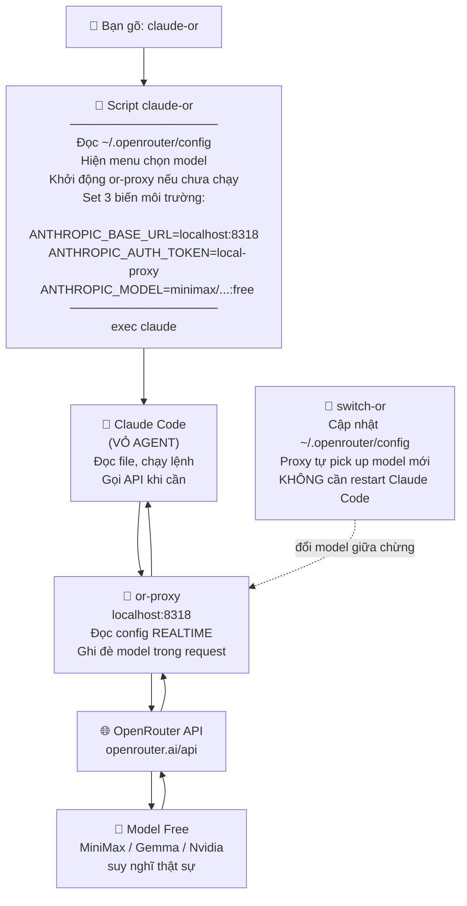

# Tích hợp OpenRouter vào Claude Code trong Orca

> **Mục đích:** Dùng các model AI **miễn phí** của OpenRouter (MiniMax, Gemma, Nvidia Nemotron...) bên trong **vỏ Claude Code** — giữ nguyên toàn bộ tính năng agent (đọc file, sửa code, chạy lệnh) mà không tốn credit Anthropic.

---

## 1. Tổng quan

| Thành phần | Vai trò |
|---|---|
| **Orca** | App điều phối AI agent trên macOS |
| **Claude Code** | Shell/agent — đọc file, chạy lệnh, sửa code |
| **OpenRouter** | Cổng API tổng hợp nhiều model, có bản miễn phí |
| **or-proxy** | Proxy local chạy ở `localhost:8318` |
| `~/.openrouter/config` | File cấu hình riêng, độc lập với Claude |

---

## 2. Cơ chế hoạt động

### 2.1 Tại sao model OpenRouter lại "chạy trong vỏ Claude Code"?

Claude Code là một **phần mềm agent** (không phải model AI). Nó chỉ biết:
- Đọc file trong folder
- Chạy terminal command
- Gọi API để lấy câu trả lời

Phần **"trí thông minh"** (suy nghĩ, trả lời) được gọi qua HTTP tới một URL. Mặc định là `api.anthropic.com`, nhưng ta có thể **chỉ định lại URL khác** bằng biến môi trường:

```
ANTHROPIC_BASE_URL  → URL server AI
ANTHROPIC_AUTH_TOKEN → API key xác thực
ANTHROPIC_MODEL     → Tên model dùng
```

OpenRouter **giả lập đúng định dạng API của Anthropic** → Claude Code không phân biệt được, cứ gọi như bình thường.

### 2.2 Sơ đồ luồng hoạt động



### 2.3 So sánh: Claude gốc vs claude-or

```
┌──────────────────────────────────────────────────────────────┐
│  CLAUDE BÌNH THƯỜNG                                          │
│                                                              │
│  Bạn → claude → api.anthropic.com → Claude Sonnet/Opus      │
│                        ↑                                     │
│                  (tốn credit $$$)                            │
└──────────────────────────────────────────────────────────────┘

┌──────────────────────────────────────────────────────────────┐
│  CLAUDE-OR (OpenRouter Free)                                 │
│                                                              │
│  Bạn → claude-or → or-proxy:8318 → openrouter.ai → Model    │
│              ↑           ↑                                   │
│         chọn model   đọc config realtime (switch-or)        │
│         lúc khởi động                                        │
│                                                              │
│                       MIỄN PHÍ 100%                          │
└──────────────────────────────────────────────────────────────┘
```

---

## 3. Cấu trúc file

```
~/.openrouter/
  └── config              ← API key + model mặc định

~/.local/bin/
  ├── or-proxy            ← Proxy server Python (localhost:8318)
  ├── claude-or           ← Lệnh khởi động (menu chọn model)
  └── switch-or           ← Đổi model giữa chừng (không restart)

~/.claude/
  └── settings.json       ← Cấu hình Claude GỐC (KHÔNG bị đụng tới)
```

### Nội dung `~/.openrouter/config`

```bash
# OpenRouter Configuration
OPENROUTER_API_KEY="sk-or-v1-..."
OPENROUTER_BASE_URL="https://openrouter.ai/api/v1"
OPENROUTER_DEFAULT_MODEL="minimax/minimax-m3:free"
```

---

## 4. Hướng dẫn sử dụng

### 4.1 Khởi động Claude Code với OpenRouter

```bash
claude-or
```

Menu hiện ra → chọn số → nhấn **Enter** → Claude Code khởi động với model đã chọn.

### 4.2 Khởi động nhanh không qua menu

```bash
claude-or --model google/gemma-4-31b-it:free
```

### 4.3 Đổi model GIỮA CHỪNG (không cần thoát)

Trong ô chat của Claude Code, gõ:

```
!switch-or
```

> ⚠️ Phải có dấu `!` phía trước — đây là cú pháp chạy shell command trong Claude Code.

Menu hiện ra → chọn model → **request tiếp theo tự dùng model mới ngay**.

### 4.4 Chạy chat tương tác đơn giản (không cần Claude Code)

```bash
openrouter          # giao diện chat
or "câu hỏi nhanh"  # hỏi 1 câu
```

Trong chat, dùng `/models` để đổi model.

---

## 5. Danh sách model Free (08/2026)

| # | Model ID | Context | Đặc điểm |
|---|---|---|---|
| 1 | `minimax/minimax-m3:free` | 1M | ⭐ Mặc định, đa năng |
| 2 | `thinkingmachines/inkling:free` | 1M | Multimodal MoE |
| 3 | `nvidia/nemotron-3-ultra-550b-a55b:free` | 1M | 🔥 550B mạnh nhất |
| 4 | `nvidia/nemotron-3-super-120b-a12b:free` | 262K | 120B, mạnh |
| 5 | `nvidia/nemotron-3.5-lightning:free` | 1M | Nhanh |
| 6 | `google/gemma-4-31b-it:free` | 262K | Google 31B |
| 7 | `google/gemma-4-26b-a4b-it:free` | 262K | Google MoE |
| 8 | `poolside/laguna-s-2.1:free` | 262K | 💻 Chuyên coding |
| 9 | `poolside/laguna-xs-2.1:free` | 262K | Coding nhẹ |
| 10 | `z-ai/glm-5.2:free` | 256K | Reasoning |
| 11 | `cohere/north-mini-code:free` | 256K | Cohere coding |
| 12 | `minimax/minimax-m2.7:free` | 196K | Agent |
| 13 | `nvidia/nemotron-3-nano-omni-30b-a3b-reasoning:free` | 256K | Omni reasoning |

> Lấy danh sách model free mới nhất:
> ```bash
> curl -sS "https://openrouter.ai/api/v1/models" | python3 -c "
> import json,sys; d=json.load(sys.stdin)
> [print(m['id']) for m in d['data'] if m['id'].endswith(':free')]"
> ```

---

## 6. Xử lý sự cố

| Vấn đề | Nguyên nhân | Cách xử lý |
|---|---|---|
| `500 HTTP Error 429` | Model bị rate limit | Dùng `!switch-or` chọn model khác |
| `claude.ai connectors are disabled` | `ANTHROPIC_API_KEY` trống | **Bình thường**, bỏ qua |
| `switch-or` không hiện menu | Gõ thiếu `!` | Gõ `!switch-or` (có dấu `!`) |
| Claude Code vẫn dùng Anthropic | Dùng `claude` thay vì `claude-or` | Gõ `claude-or` thay thế |
| Proxy không chạy | Port 8318 bị chiếm | `pkill -f or-proxy && claude-or` |

---

## 7. Chú ý bảo mật

> [!WARNING]
> API key của OpenRouter được lưu dạng **văn bản thuần** trong `~/.openrouter/config`. Không commit file này lên Git, không share với người khác.

---

## 8. Tham khảo

- Lấy API key: https://openrouter.ai/keys
- Danh sách model: https://openrouter.ai/models
- Trang chủ Orca: https://www.orca.dev
